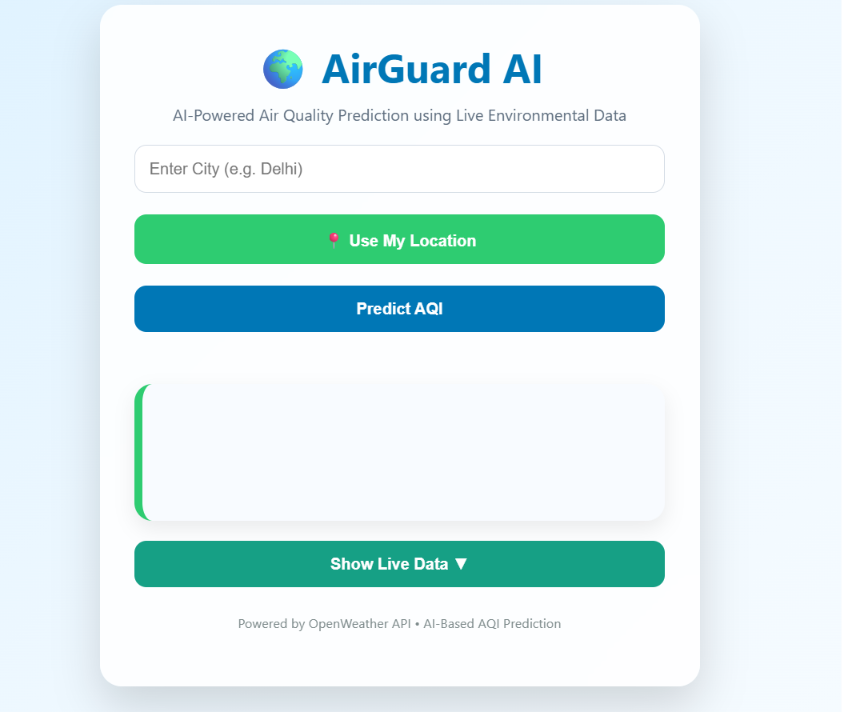
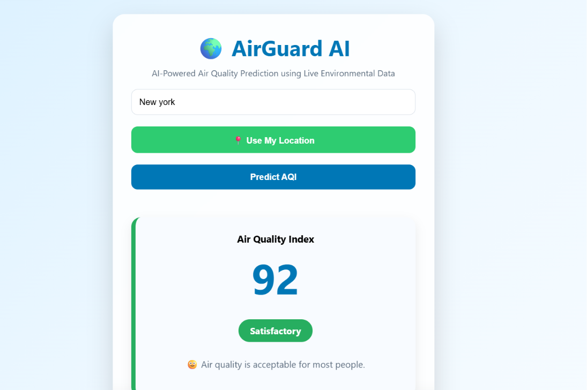
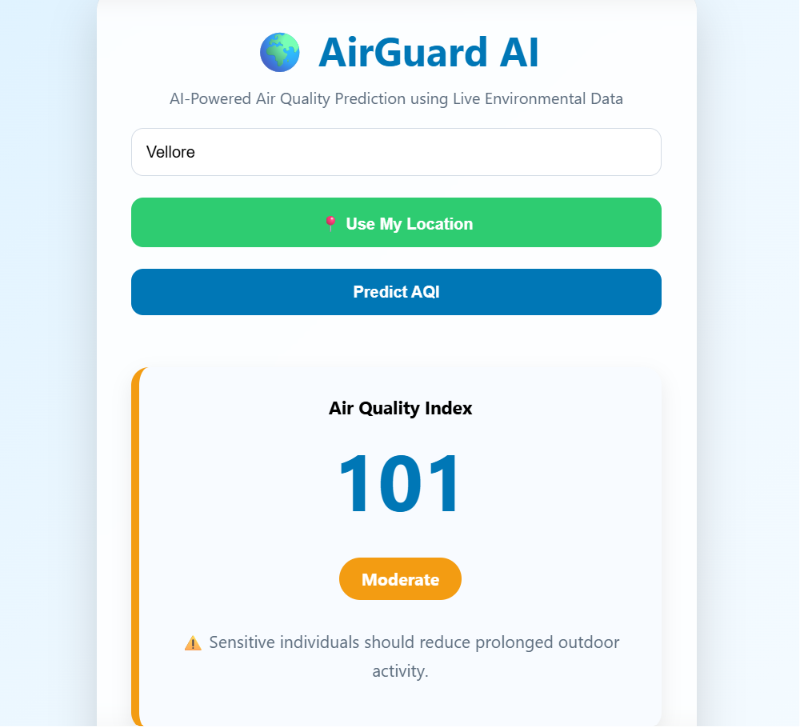
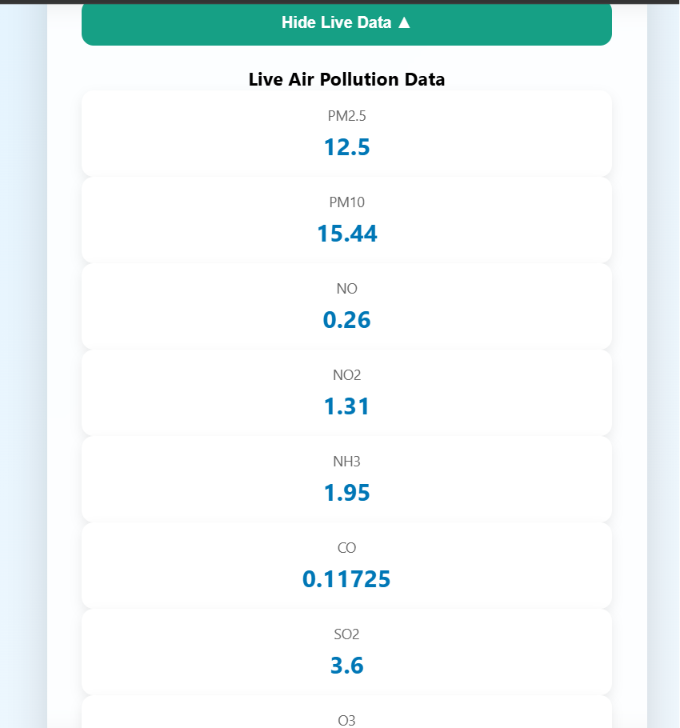
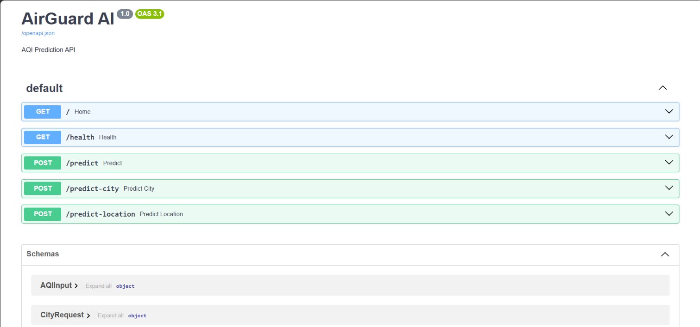

# 🌍 AirGuard AI

AirGuard AI is a Machine Learning-powered web application that predicts the **Air Quality Index (AQI)** for any city using **live air pollution data** from the OpenWeather API. The application combines real-time environmental data with a trained Random Forest model to provide AQI predictions, pollutant information, air quality categories, and personalized health recommendations through an intuitive web interface.

🚀 **Live Demo:** https://air-guard-ai-frontend.vercel.app

🔗 **Backend API:** https://airguard-ai-backend.onrender.com/docs

---

## ✨ Features

- Predict AQI for any city worldwide
- Use your current location for instant AQI prediction
- Live air pollution data from the OpenWeather API
- Random Forest Machine Learning model
- AQI category classification (Good, Moderate, Poor, etc.)
- Personalized health recommendations
- Interactive REST API built with FastAPI
- Automatic season detection
- Interactive Swagger API documentation

---

## 🛠️ Tech Stack

### Machine Learning
- Python
- Scikit-learn
- Pandas
- NumPy
- Joblib

### Backend
- FastAPI
- Pydantic
- Uvicorn
- Requests
- Python-dotenv

### Frontend
- HTML
- CSS
- JavaScript

### APIs
- OpenWeather Geocoding API
- OpenWeather Air Pollution API

---

## 📂 Project Structure

```text
AirGuard-AI/
│
├── backend/
│   ├── app.py
│   ├── model.py
│   ├── utils.py
│   ├── weather_api.py
│   └── routes.py
│
├── frontend/
│   ├── index.html
│   ├── style.css
│   └── script.js
│
├── models/
│   ├── random_forest_model.pkl
│   └── model_columns.pkl
│
├── docs/
│   ├── home.png
│   ├── prediction.png
│   ├── pollutants.png
│   └── swagger.png
│
├── requirements.txt
├── README.md
└── .env
```

---

## ⚙️ Installation

Clone the repository

```bash
git clone https://github.com/NAVYA1709/AirGuard-AI.git
cd AirGuard-AI
```

Create a virtual environment

```bash
python -m venv venv
```

Activate the virtual environment

### Windows

```bash
venv\Scripts\activate
```

Install dependencies

```bash
pip install -r requirements.txt
```

Create a `.env` file in the project root

```text
OPENWEATHER_API_KEY=YOUR_API_KEY
```

---

## 🚀 Running the Project

Start the FastAPI backend

```bash
uvicorn backend.app:app --reload
```

Open the frontend using VS Code Live Server or any local web server.

Visit the application

```text
http://127.0.0.1:5501/frontend/index.html
```

Swagger Documentation

```text
http://127.0.0.1:8000/docs
```

---

## 📡 API Endpoints

| Method | Endpoint | Description |
|--------|----------|-------------|
| GET | `/` | Home endpoint |
| GET | `/health` | API health check |
| POST | `/predict` | Predict AQI using pollutant values |
| POST | `/predict-city` | Predict AQI using a city name |
| POST | `/predict-location` | Predict AQI using GPS coordinates |

---

## 🤖 Machine Learning Model

**Algorithm:** Random Forest Regressor

### Input Features

- PM2.5
- PM10
- NO
- NO₂
- NOx
- NH₃
- CO
- SO₂
- O₃
- Benzene
- Toluene
- Year
- Month
- Day
- DayOfWeek
- City
- Season

### Output

- Predicted Air Quality Index (AQI)

---

## 📸 Screenshots

### Home Page



### AQI Prediction





### Live Pollutant Data



### Swagger API



---

## 🔮 Future Improvements

- AQI trend visualization
- Interactive map integration
- Historical AQI analysis
- Weather forecast integration
- Mobile application
- User authentication
- Favorite locations
- AQI alerts and notifications

---

## 👩‍💻 Author

**Navya Kothuri**

Integrated M.Tech Software Engineering  
VIT Vellore

GitHub: https://github.com/NAVYA1709

LinkedIn: https://www.linkedin.com/in/navyasri-kothuri-b14b6034a

---

## 📌 Project Status

✅ Functional MVP developed for **SmartAIthon 2026**

The project successfully integrates Machine Learning with real-time environmental data to provide intelligent Air Quality Index predictions and health recommendations.
